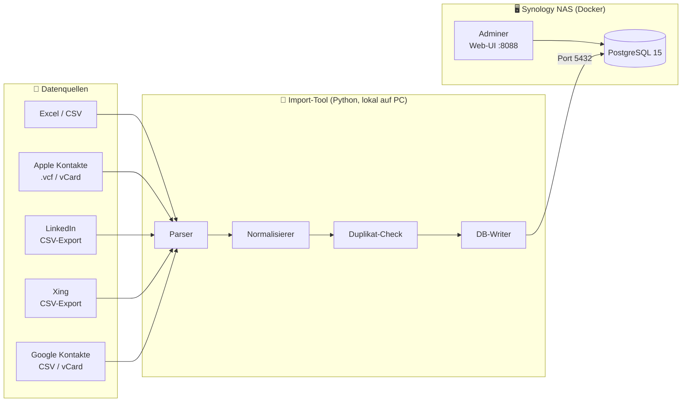

# 00 · Systemübersicht

**Stand:** 2026-09-03  
**Status:** ✅ Freigegeben

## Ziel

Aufbau einer zentralen, lokal gehosteten Kontaktdatenbank auf einem **Synology NAS**.  
Kontakte aus verschiedenen Quellen (LinkedIn, Apple, Excel, ...) werden importiert, normalisiert, dedupliziert und dauerhaft gespeichert.

---

## Gesamtarchitektur

---

## Komponenten

| Komponente | Technologie | Läuft auf |
|---|---|---|
| Datenbank | PostgreSQL 15 | Synology NAS (Docker) |
| Web-UI | Adminer | Synology NAS (Docker) |
| Import-Tool | Python 3.11+ | Windows PC (lokal) |
| Container-Management | Container Station | Synology NAS |

---

## Architekturentscheidungen (ADR)

### ADR-001: PostgreSQL statt MariaDB/SQLite

**Entscheidung:** PostgreSQL  
**Begründung:**
- Beste Unterstützung für JSON-Felder (flexible Rohdaten-Speicherung)
- Vollständige ACID-Compliance
- Hervorragende Python-Bibliotheken (`psycopg2`, `SQLAlchemy`)
- Weit verbreitet auf Synology via Docker

### ADR-002: Import-Tool lokal (nicht auf NAS)

**Entscheidung:** Python-Script läuft auf dem Windows-PC, nicht auf dem NAS  
**Begründung:**
- Einfacheres Dateisystem-Handling (Quell-Dateien liegen auf dem PC)
- Kein Python-Setup auf dem NAS nötig
- Das NAS bleibt schlank (nur Datenbank)

### ADR-003: Adminer statt pgAdmin

**Entscheidung:** Adminer als Web-UI  
**Begründung:**
- Extrem leichtgewichtig (ein einziges PHP-File)
- Kein zusätzlicher Ressourcenverbrauch auf dem NAS
- Reicht für Inspektion und manuelle Abfragen vollständig aus

---

## Nicht im Scope (vorerst)

- ❌ Automatischer Sync (Cron-Jobs / Webhooks) — manueller Import reicht zunächst
- ❌ Web-Frontend für Suche/Anzeige — Adminer und direkte SQL-Abfragen
- ❌ Fernzugriff über Internet / VPN — nur lokales Netzwerk
- ❌ Mobile App
