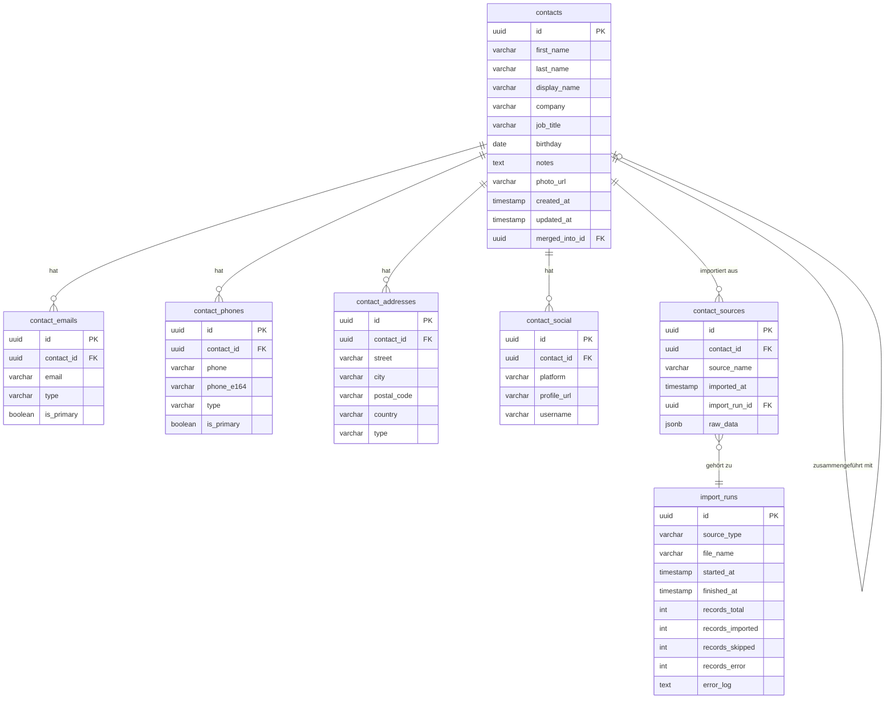

# 01 · Datenbankschema

**Stand:** 2026-09-03  
**Status:** ✅ Freigegeben  
**Datenbank:** PostgreSQL 15

---

## Entity-Relationship-Diagramm



---

## Tabellenbeschreibungen

### `contacts` — Kernkontakt

Die zentrale Tabelle. Jede Person hat genau einen Datensatz hier.

| Spalte | Typ | Beschreibung |
|---|---|---|
| `id` | UUID (PK) | Eindeutige ID, auto-generiert |
| `first_name` | VARCHAR(100) | Vorname |
| `last_name` | VARCHAR(100) | Nachname |
| `display_name` | VARCHAR(255) | Anzeigename (z.B. aus vCard `FN`) |
| `company` | VARCHAR(255) | Firma / Organisation |
| `job_title` | VARCHAR(255) | Berufsbezeichnung |
| `birthday` | DATE | Geburtstag |
| `notes` | TEXT | Freitext-Notizen |
| `photo_url` | VARCHAR(500) | Pfad zu Profilfoto |
| `merged_into_id` | UUID (FK, self) | Bei Merge: Zeigt auf den "Überlebenden" |
| `created_at` | TIMESTAMP | Wann angelegt |
| `updated_at` | TIMESTAMP | Wann zuletzt geändert |

---

### `contact_emails` — E-Mail-Adressen

Ein Kontakt kann mehrere E-Mail-Adressen haben.

| Spalte | Typ | Beschreibung |
|---|---|---|
| `type` | VARCHAR | `work`, `personal`, `other` |
| `is_primary` | BOOLEAN | Hauptadresse für Benachrichtigungen |

---

### `contact_phones` — Telefonnummern

| Spalte | Typ | Beschreibung |
|---|---|---|
| `phone` | VARCHAR | Nummer wie eingegeben |
| `phone_e164` | VARCHAR | Normalisiert im E.164-Format (`+4915...`) |
| `type` | VARCHAR | `mobile`, `work`, `home`, `fax` |

---

### `contact_social` — Social Media Profile

| `platform` | Beispiel-URL |
|---|---|
| `linkedin` | `https://linkedin.com/in/...` |
| `xing` | `https://xing.com/profile/...` |
| `github` | `https://github.com/...` |
| `twitter` | `https://twitter.com/...` |

---

### `contact_sources` — Import-Herkunft

Speichert, aus welchem Import ein Kontakt stammt. Das Feld `raw_data` (JSONB) enthält die Originalzeile aus der Quelldatei — unveränderlich als Audit-Log.

---

### `import_runs` — Import-Protokoll

Jeder Importvorgang erzeugt einen Eintrag mit Start/Ende, Anzahl importierter Records und einem optionalen Fehler-Log.

---

## Indexstrategie

```sql
-- Schnelle Namenssuche
CREATE INDEX idx_contacts_last_name ON contacts (lower(last_name));
CREATE INDEX idx_contacts_company   ON contacts (lower(company));

-- Schnelle E-Mail-Suche (für Deduplizierung)
CREATE INDEX idx_emails_email ON contact_emails (lower(email));

-- Duplikat-Check-Index
CREATE INDEX idx_contacts_name_company 
    ON contacts (lower(last_name), lower(first_name), lower(company));
```

---

## Wichtige Views

### `v_contacts_full` — Vollansicht eines Kontakts

Aggregiert alle Emails, Telefone und Social-Profile als Arrays für einfache Abfragen ohne JOINs:

```sql
SELECT
    c.*,
    array_agg(DISTINCT e.email)         AS emails,
    array_agg(DISTINCT p.phone_e164)    AS phones,
    array_agg(DISTINCT s.platform || ':' || s.profile_url) AS social
FROM contacts c
LEFT JOIN contact_emails   e ON e.contact_id = c.id
LEFT JOIN contact_phones   p ON p.contact_id = c.id
LEFT JOIN contact_social   s ON s.contact_id = c.id
GROUP BY c.id;
```
