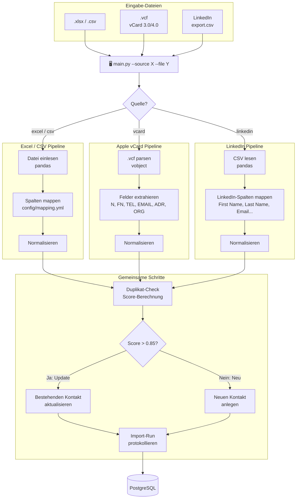

# 02 · Import-Pipelines

**Stand:** 2026-09-03  
**Status:** ✅ Freigegeben

---

## Übersicht aller Pipelines



---

## Pipeline 1: Excel / CSV

### Unterstützte Formate
- `.csv` (Trennzeichen: `,` oder `;` — auto-erkannt)
- `.xlsx` (erste Tabelle wird verwendet)

### Spalten-Mapping

Das Mapping ist konfigurierbar über `config/mapping_excel.yml`. Beispiel:

```yaml
# config/mapping_excel.yml
columns:
  first_name:   ["Vorname", "First Name", "first_name", "Firstname"]
  last_name:    ["Nachname", "Last Name", "last_name", "Surname"]
  email:        ["E-Mail", "Email", "email", "E-Mail-Adresse"]
  phone:        ["Telefon", "Phone", "Mobil", "Mobile", "Tel."]
  company:      ["Firma", "Company", "Unternehmen", "Organisation"]
  job_title:    ["Position", "Job Title", "Titel", "Berufsbezeichnung"]
```

### Datenfluss

```
Zeile 1 (Header) → Spaltenname-Erkennung via Mapping
Zeile 2..N       → Pro Zeile: normalize() → dedup_check() → insert_or_update()
```

---

## Pipeline 2: Apple vCard (.vcf)

### Unterstützte vCard-Versionen
- vCard 3.0 (Apple Kontakte Export)
- vCard 4.0

### Wichtige vCard-Felder

| vCard-Feld | Mapped auf |
|---|---|
| `FN` | `display_name` |
| `N` | `first_name`, `last_name` |
| `ORG` | `company` |
| `TITLE` | `job_title` |
| `TEL` | `contact_phones` |
| `EMAIL` | `contact_emails` |
| `ADR` | `contact_addresses` |
| `BDAY` | `birthday` |
| `NOTE` | `notes` |
| `PHOTO` | `photo_url` (Base64 → Datei) |

### Besonderheiten
- Eine `.vcf`-Datei kann **mehrere Kontakte** enthalten (getrennt durch `BEGIN:VCARD` / `END:VCARD`)
- Telefonnummern haben Labels wie `type=CELL`, `type=WORK` → wird auf `mobile`, `work` gemappt
- Fotos werden als Base64 in der vCard gespeichert → werden als Datei extrahiert

---

## Pipeline 3: LinkedIn CSV-Export

### Export herunterladen
`linkedin.com → Einstellungen → Datenschutz → Eigene Daten herunterladen → Contacts.csv`

### LinkedIn CSV-Spaltenstruktur

| LinkedIn-Spalte | Mapped auf |
|---|---|
| `First Name` | `first_name` |
| `Last Name` | `last_name` |
| `Email Address` | `contact_emails` |
| `Company` | `company` |
| `Position` | `job_title` |
| `Connected On` | `contact_sources.imported_at` |
| Profil-URL | `contact_social` (platform=`linkedin`) |

> [!NOTE]
> LinkedIn-Exporte enthalten **keine Telefonnummern** — nur Name, Firma, E-Mail und Verbindungsdatum.

---

## Normalisierung (gemeinsam für alle Pipelines)

| Feld | Normalisierung |
|---|---|
| E-Mail | `lowercase`, Whitespace entfernen |
| Telefon | E.164-Format (`+49...`) via `phonenumbers`-Library |
| Name | Trim, Titel entfernen (`Dr.`, `Prof.`) |
| Firma | Trim, `GmbH` / `AG` Schreibweisen vereinheitlichen |

---

## CLI-Verwendung (geplant)

```bash
# Excel importieren
python main.py --source excel --file "C:/Users/nils/Downloads/kontakte.xlsx"

# Apple vCard importieren
python main.py --source vcard --file "C:/Users/nils/Downloads/Kontakte.vcf"

# LinkedIn importieren
python main.py --source linkedin --file "C:/Users/nils/Downloads/Connections.csv"

# Dry-Run (kein Schreiben in DB)
python main.py --source excel --file kontakte.xlsx --dry-run
```
