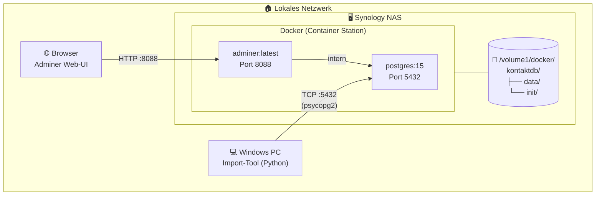

# 03 · Deployment auf Synology NAS

**Stand:** 2026-09-03  
**Status:** ✅ Freigegeben

---

## Netzwerk-Übersicht



---

## Verzeichnisstruktur auf dem NAS

```
/volume1/docker/kontaktdb/
├── data/          ← PostgreSQL Daten (persistent Volume)
├── init/          ← SQL-Init-Skripte (werden beim ersten Start ausgeführt)
│   ├── 01_create_tables.sql
│   ├── 02_indexes.sql
│   └── 03_views.sql
└── docker-compose.yml
```

---

## docker-compose.yml

```yaml
version: "3.8"

services:
  postgres:
    image: postgres:15
    container_name: kontaktdb_postgres
    restart: unless-stopped
    ports:
      - "5432:5432"
    environment:
      POSTGRES_DB: kontakte
      POSTGRES_USER: ${DB_USER}
      POSTGRES_PASSWORD: ${DB_PASSWORD}
    volumes:
      - ./data:/var/lib/postgresql/data
      - ./init:/docker-entrypoint-initdb.d  # Init-Skripte

  adminer:
    image: adminer:latest
    container_name: kontaktdb_adminer
    restart: unless-stopped
    ports:
      - "8088:8080"
    environment:
      ADMINER_DEFAULT_SERVER: postgres
    depends_on:
      - postgres

networks:
  default:
    name: kontaktdb_net
```

---

## .env Template

```env
# Datenbankzugang – NICHT in Git einchecken!
DB_USER=kontakt_admin
DB_PASSWORD=HIER_SICHERES_PASSWORT_SETZEN

# Verbindung vom PC aus
DB_HOST=192.168.x.x        # IP des Synology NAS im LAN
DB_PORT=5432
DB_NAME=kontakte
```

---

## Setup-Schritte auf dem Synology NAS

### Voraussetzungen
- DSM 7.x installiert
- **Container Station** aus dem Package Center installiert
- SSH-Zugriff aktiviert (optional, aber hilfreich)

### Schritt 1: Verzeichnis anlegen

Per SSH oder File Station:
```bash
mkdir -p /volume1/docker/kontaktdb/data
mkdir -p /volume1/docker/kontaktdb/init
```

### Schritt 2: Dateien hochladen

Folgende Dateien in `/volume1/docker/kontaktdb/` übertragen:
- `docker-compose.yml`
- `.env` (mit gesetztem Passwort)
- `schema/*.sql` → nach `init/`

### Schritt 3: Stack starten (Container Station)

1. Container Station öffnen
2. **Projekt** → **Erstellen**
3. Quellpfad: `/volume1/docker/kontaktdb`
4. **Erstellen** klicken

Alternativ per SSH:
```bash
cd /volume1/docker/kontaktdb
docker compose up -d
```

### Schritt 4: Verbindung testen

**Adminer im Browser:**
```
http://<NAS-IP>:8088
Server:   postgres
Benutzer: kontakt_admin
Passwort: (aus .env)
Datenbank: kontakte
```

**Python-Verbindungstest:**
```python
import psycopg2
conn = psycopg2.connect(
    host="192.168.x.x",
    port=5432,
    dbname="kontakte",
    user="kontakt_admin",
    password="..."
)
print("Verbindung OK:", conn.server_version)
```

---

## Firewall-Hinweis

> [!WARNING]
> Port 5432 (PostgreSQL) sollte **nicht** nach außen (Internet) geöffnet werden.  
> Der Zugriff ist ausschließlich im lokalen Netzwerk vorgesehen.  
> In der Synology Firewall (Systemsteuerung → Sicherheit → Firewall) nur LAN-Zugriff erlauben.

---

## Backup-Strategie

| Was | Wie | Intervall |
|---|---|---|
| PostgreSQL Dump | `pg_dump kontakte > backup.sql` | Täglich (Cron auf NAS) |
| Docker Volume | Synology Hyper Backup | Wöchentlich |
| Init-Skripte | In Git-Repository | Bei Änderung |
