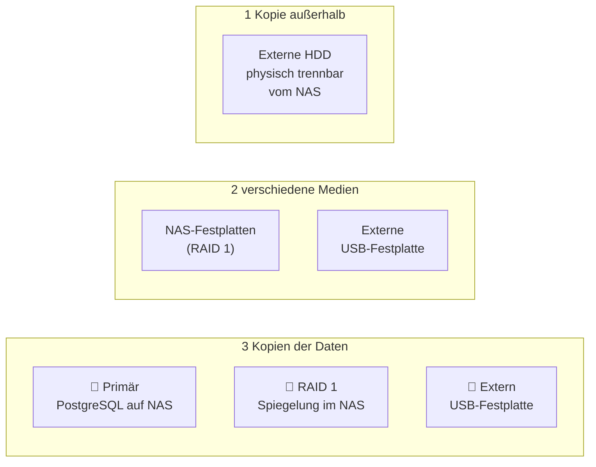
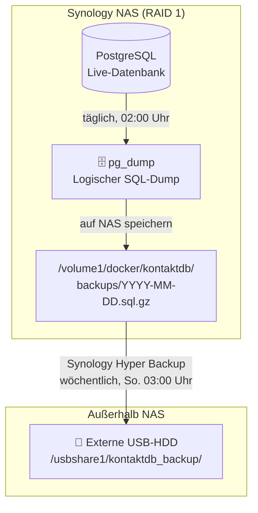

# 04 · Backup-Strategie

**Stand:** 2026-09-03  
**Status:** ✅ Freigegeben

---

## Grundprinzip: 3-2-1-Regel

> [!IMPORTANT]
> **RAID 1 ist kein Backup!** RAID schützt vor dem Ausfall einer Festplatte, nicht vor versehentlichem Löschen, Datenbankkorruption, Ransomware oder Feuerschäden. Eine separate Backup-Strategie ist zwingend erforderlich.

Die **3-2-1-Regel** gilt als Mindeststandard:



| Regel | Umsetzung |
|---|---|
| **3** Kopien | Live-DB + RAID-Spiegel + Externe HDD |
| **2** Medien | NAS-Platten + externe USB-HDD |
| **1** außerhalb | Externe HDD (physisch vom NAS trennbar) |

---

## Backup-Ebenen



---

## Ebene 1: Täglicher PostgreSQL-Dump (logisches Backup)

Ein `pg_dump` erzeugt einen vollständigen, wiederherstellbaren SQL-Dump der Datenbank — unabhängig vom Dateisystem.

### Backup-Script

Datei: `/volume1/docker/kontaktdb/scripts/backup.sh`

```bash
#!/bin/bash
# Täglich per Synology Aufgabenplaner ausführen

BACKUP_DIR="/volume1/docker/kontaktdb/backups"
TIMESTAMP=$(date +%Y-%m-%d)
CONTAINER="kontaktdb_postgres"
DB_NAME="kontakte"
DB_USER="kontakt_admin"
KEEP_DAYS=14   # Lokale Backups 14 Tage aufbewahren

# Backup erstellen
docker exec $CONTAINER pg_dump -U $DB_USER $DB_NAME \
  | gzip > "$BACKUP_DIR/${TIMESTAMP}.sql.gz"

echo "✅ Backup erstellt: ${TIMESTAMP}.sql.gz"

# Alte Backups löschen (älter als KEEP_DAYS)
find $BACKUP_DIR -name "*.sql.gz" -mtime +$KEEP_DAYS -delete
echo "🧹 Alte Backups (älter als $KEEP_DAYS Tage) gelöscht"
```

### Einrichten im Synology Aufgabenplaner

1. DSM → **Systemsteuerung** → **Aufgabenplaner**
2. **Erstellen** → **Geplante Aufgabe** → **Benutzerdefiniertes Skript**
3. Einstellungen:
   - Name: `PostgreSQL Tages-Backup`
   - Benutzer: `root`
   - Zeitplan: **Täglich, 02:00 Uhr**
   - Skript: Inhalt von `backup.sh`

### Aufbewahrung (lokal auf NAS)

| Zeitraum | Anzahl Backups |
|---|---|
| Täglich | 14 Tage |
| Gesamt (max.) | ~200 MB bei typischer Kontaktgröße |

---

## Ebene 2: Wöchentliches Backup auf externe USB-HDD

Synology **Hyper Backup** kopiert die lokalen Backup-Dateien wöchentlich auf die externe Festplatte.

### Setup Hyper Backup

1. **Hyper Backup** aus dem Package Center installieren
2. **Sicherungsaufgabe erstellen**:
   - Ziel: **Lokaler Ordner & USB** → externe HDD auswählen
   - Quellordner: `/volume1/docker/kontaktdb/backups/`
   - Zeitplan: **Wöchentlich, Sonntag 03:00 Uhr**
   - Versionen aufbewahren: **8 Wochen** (= 8 Backups)

### Externe HDD

| Eigenschaft | Empfehlung |
|---|---|
| Anschluss | USB 3.0 am Synology NAS |
| Kapazität | ≥ 500 GB (großzügig für Wachstum) |
| Format | ext4 (Linux) oder exFAT |
| Aufbewahrungsort | Physisch vom NAS getrennt lagerbar (z.B. anderer Raum) |

---

## Backup-Zeitplan Übersicht

```mermaid
gantt
    title Backup-Zeitplan (Woche)
    dateFormat  HH:mm
    axisFormat %H:%M

    section Täglich (Mo-So)
    pg_dump auf NAS :active, 02:00, 30m

    section Wöchentlich (Sonntag)
    Hyper Backup → ext. HDD :03:00, 2h
```



| Aufgabe | Häufigkeit | Zeit | Ziel | Aufbewahrung |
|---|---|---|---|---|
| `pg_dump` SQL-Dump | Täglich | 02:00 | NAS lokal | 14 Tage |
| Hyper Backup | Wöchentlich (So.) | 03:00 | Externe USB-HDD | 8 Wochen |

---

## Wiederherstellung (Recovery)

### Fall 1: Datenbank-Inhalt versehentlich gelöscht

```bash
# Letzten Dump wiederherstellen
BACKUP_FILE="/volume1/docker/kontaktdb/backups/2026-09-03.sql.gz"

gunzip -c $BACKUP_FILE | docker exec -i kontaktdb_postgres \
  psql -U kontakt_admin -d kontakte
```

### Fall 2: NAS-Ausfall (kompletter Datenverlust)

1. Neue PostgreSQL-Instanz starten (Docker)
2. Externe USB-HDD anschließen
3. Neueste `.sql.gz`-Datei von HDD kopieren
4. Wie Fall 1 wiederherstellen

### Fall 3: Einzelnen Kontakt wiederherstellen

```sql
-- Backup in temporäre Datenbank einspielen, dann gezielt abfragen
CREATE DATABASE kontakte_restore;
-- (Dump einspielen)
SELECT * FROM kontakte_restore.contacts WHERE last_name = 'Mustermann';
```

---

## Backup prüfen (monatlich empfohlen)

> [!TIP]
> Ein Backup, das nie getestet wurde, ist kein Backup. Monatlicher Restore-Test empfohlen.

```bash
# Test-Restore in separate DB
docker exec kontaktdb_postgres createdb -U kontakt_admin kontakte_test

gunzip -c /volume1/docker/kontaktdb/backups/$(date +%Y-%m-%d).sql.gz \
  | docker exec -i kontaktdb_postgres psql -U kontakt_admin -d kontakte_test

# Datensätze zählen (sollte > 0 sein)
docker exec kontaktdb_postgres psql -U kontakt_admin -d kontakte_test \
  -c "SELECT COUNT(*) FROM contacts;"

# Test-DB wieder löschen
docker exec kontaktdb_postgres dropdb -U kontakt_admin kontakte_test
```
