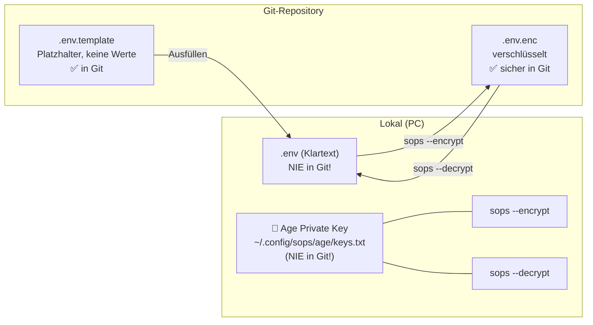
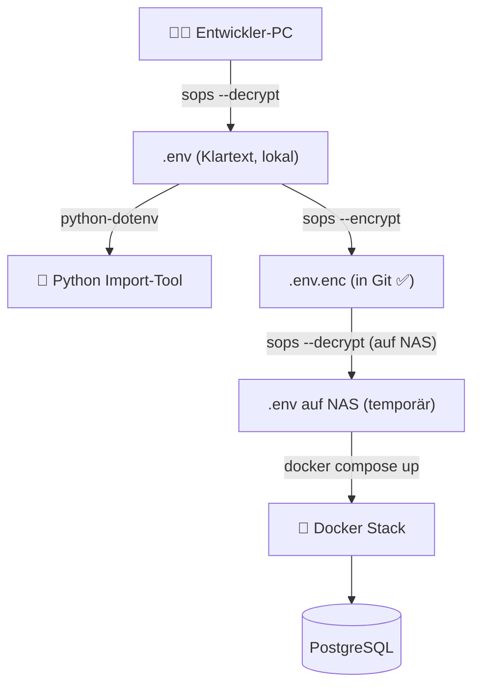

# 05 · Secrets Management

**Stand:** 2026-09-03  
**Status:** ✅ Freigegeben

---

## Ziel

Alle Zugangsdaten (Passwörter, DB-Credentials, API-Keys) müssen:

- ✅ **Konfigurierbar** sein — kein Hardcoding im Quellcode
- ✅ **Verschlüsselt** abgelegt werden — sicher bei Git-Commits und Backups
- ✅ **Nie im Klartext** in einem Git-Repository landen
- ✅ **Einfach handhabbar** bleiben — kein Enterprise-Overhead

---

## Architektur-Entscheidung (ADR-004)

### Gewählter Ansatz: SOPS + Age

| Tool | Rolle |
|---|---|
| **[Age](https://github.com/FiloSottile/age)** | Modernes, einfaches Verschlüsselungsformat (Nachfolger von GPG) |
| **[SOPS](https://github.com/getsops/sops)** | Verschlüsselt `.env`-Dateien mit Age-Keys; nur die Werte, nicht die Schlüssel |



**Vorteil gegenüber Alternativen:**
- Nur **Werte** werden verschlüsselt — die Schlüsselnamen bleiben lesbar (Diff-freundlich)
- Kein Server nötig (kein Vault, kein KMS)
- Funktioniert offline
- `.env.enc` kann sicher in Git committed werden

---

## Dateien & ihre Rolle

| Datei | In Git? | Inhalt |
|---|---|---|
| `.env.template` | ✅ Ja | Struktur mit leeren Platzhaltern |
| `.env.enc` | ✅ Ja | SOPS-verschlüsselte Secrets |
| `.env` | ❌ **Nein** (`.gitignore`) | Klartext-Secrets (nur lokal) |
| `~/.config/sops/age/keys.txt` | ❌ **Nein** | Privater Age-Key (außerhalb Repo) |

---

## Welche Secrets werden verwaltet?

```ini
# .env.template — Struktur (kein Geheimnis, in Git)

# === Datenbank ===
DB_HOST=            # IP des Synology NAS
DB_PORT=5432
DB_NAME=kontakte
DB_USER=            # DB-Benutzername
DB_PASSWORD=        # ← verschlüsselt via SOPS

# === Docker ===
POSTGRES_PASSWORD=  # ← verschlüsselt via SOPS

# === Adminer ===
# (kein separates Passwort, nutzt DB-Credentials)
```

---

## Einrichtung (einmalig)

### 1. Age und SOPS installieren (Windows)

```powershell
# Age installieren (via winget)
winget install FiloSottile.age

# SOPS installieren (via winget)
winget install mozilla.sops
```

### 2. Age-Schlüsselpaar generieren

```powershell
# Verzeichnis anlegen
New-Item -ItemType Directory -Force "$env:APPDATA\sops\age"

# Schlüsselpaar generieren
age-keygen -o "$env:APPDATA\sops\age\keys.txt"

# Ausgabe zeigt den Public Key:
# Public key: age1xxxxxxxxxxxxxxxxxxxxxxxxxxxxxxxxxxxxxxxxxxxxxxxxxxxxxxxx
```

> [!CAUTION]
> Den **privaten Key** (`keys.txt`) sicher aufbewahren und **niemals in Git einchecken**.  
> Ohne diesen Key können die Secrets nicht mehr entschlüsselt werden.  
> Empfehlung: Kopie auf einem USB-Stick oder Passwort-Manager speichern.

### 3. SOPS-Konfiguration anlegen

Datei: `.sops.yaml` im Projekt-Root (wird in Git eingecheckt):

```yaml
# .sops.yaml
creation_rules:
  - path_regex: \.env$
    age: age1xxxxxxxxxxxxxxxxxxxxxxxxxxxxxxxxxxxxxxxxxxxxxxxxxxxxxxxx
    # ↑ Hier den eigenen PUBLIC Key eintragen
```

### 4. `.env` befüllen und verschlüsseln

```powershell
# 1. Template kopieren
Copy-Item .env.template .env

# 2. .env mit echten Werten befüllen (Texteditor)
notepad .env

# 3. Verschlüsseln
sops --encrypt .env > .env.enc

# 4. Klartext-Version löschen oder in .gitignore sicherstellen
```

### 5. `.gitignore` sicherstellen

```gitignore
# Secrets – niemals einchecken!
.env
*.key
keys.txt
```

---

## Tägliche Verwendung

### Secrets entschlüsseln (zum Arbeiten)

```powershell
# Temporär entschlüsseln
sops --decrypt .env.enc > .env

# Oder direkt als Umgebungsvariablen laden (empfohlen)
sops exec-env .env.enc "python main.py --source linkedin --file Connections.csv"
```

### Secrets aktualisieren

```powershell
# .env.enc direkt bearbeiten (SOPS öffnet Editor, speichert verschlüsselt)
sops .env.enc
```

---

## Verwendung im Python-Code

```python
# importer/config.py
from dotenv import load_dotenv
import os

load_dotenv()  # Lädt .env-Datei (Klartext, nur lokal vorhanden)

DB_CONFIG = {
    "host":     os.getenv("DB_HOST",     "192.168.1.x"),
    "port":     int(os.getenv("DB_PORT", "5432")),
    "dbname":   os.getenv("DB_NAME",     "kontakte"),
    "user":     os.getenv("DB_USER"),
    "password": os.getenv("DB_PASSWORD"),
}

# Validierung beim Start
if not DB_CONFIG["password"]:
    raise EnvironmentError("DB_PASSWORD nicht gesetzt! .env-Datei prüfen.")
```

> [!NOTE]
> Der Python-Code enthält **keinerlei Zugangsdaten** — nur `os.getenv()`-Aufrufe.  
> Die eigentlichen Werte kommen ausschließlich aus der lokalen `.env`-Datei.

---

## Auf dem Synology NAS (Docker)

Die `.env`-Datei wird beim Starten des Docker-Stacks direkt von `docker compose` eingelesen:

```bash
# Auf dem NAS: .env.enc entschlüsseln und docker compose starten
sops --decrypt /volume1/docker/kontaktdb/.env.enc > /volume1/docker/kontaktdb/.env
cd /volume1/docker/kontaktdb
docker compose up -d
# .env danach wieder löschen (optional, erhöht Sicherheit)
rm /volume1/docker/kontaktdb/.env
```

---

## Übersicht: Was geht wohin


