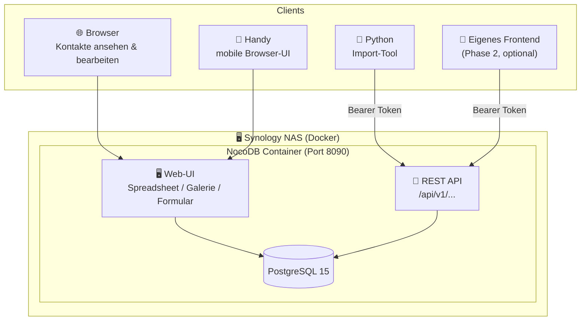
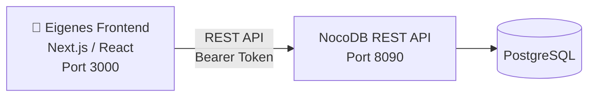

# 06 · UI & REST API

**Stand:** 2026-09-03  
**Status:** ✅ Freigegeben

---

## Übersicht



---

## Phase 1: NocoDB

### Was NocoDB liefert

| Feature | Beschreibung |
|---|---|
| **Spreadsheet-Ansicht** | Excel-ähnliche Tabellenansicht aller Kontakte |
| **Galerie-Ansicht** | Kachelansicht mit Foto, Name, Firma |
| **Suche & Filter** | Nach beliebigen Feldern filtern, ohne SQL |
| **Inline-Editing** | Direkt in der Tabelle bearbeiten |
| **Formular-Ansicht** | Einzelkontakt-Detailansicht |
| **REST API** | Automatisch generiert für alle Tabellen |
| **API-Dokumentation** | Swagger/OpenAPI unter `/api/swagger` |
| **API-Token-Verwaltung** | Tokens pro User, widerrufbar |

### Docker-Integration

NocoDB wird als weiterer Service in die bestehende `docker-compose.yml` eingefügt:

```yaml
  nocodb:
    image: nocodb/nocodb:latest
    container_name: kontaktdb_nocodb
    restart: unless-stopped
    ports:
      - "8090:8080"
    environment:
      NC_DB: "pg://postgres:5432?u=${DB_USER}&p=${DB_PASSWORD}&d=${DB_NAME}"
      NC_AUTH_JWT_SECRET: ${NOCODB_JWT_SECRET}
    depends_on:
      - postgres
    volumes:
      - ./nocodb_data:/usr/app/data
```

> [!NOTE]
> `NC_DB` verbindet NocoDB direkt mit der bestehenden PostgreSQL-Instanz.  
> NocoDB liest alle Tabellen ein und macht sie sofort über UI und API verfügbar.

### Erreichbarkeit

| Service | URL | Verwendung |
|---|---|---|
| NocoDB Web-UI | `http://<NAS-IP>:8090` | Browser / Handy |
| REST API | `http://<NAS-IP>:8090/api/v1/` | Programmatischer Zugriff |
| API Docs (Swagger) | `http://<NAS-IP>:8090/api/swagger` | API-Dokumentation |

---

## REST API

### Authentifizierung

Alle API-Aufrufe benötigen einen **API-Token** aus der NocoDB-Oberfläche:

```
Authorization: Bearer <token>
```

Tokens werden in NocoDB unter **Team & Settings → API Tokens** erstellt und können jederzeit widerrufen werden. Der Token wird über das Secrets-Management (SOPS/Age) verwaltet — nicht im Code.

### Wichtige Endpunkte

```
GET    /api/v1/db/data/noco/{projectId}/contacts         → Alle Kontakte (paginiert)
GET    /api/v1/db/data/noco/{projectId}/contacts/{id}    → Einzelner Kontakt
POST   /api/v1/db/data/noco/{projectId}/contacts         → Neuer Kontakt
PATCH  /api/v1/db/data/noco/{projectId}/contacts/{id}    → Kontakt aktualisieren
DELETE /api/v1/db/data/noco/{projectId}/contacts/{id}    → Kontakt löschen
```

### Query-Parameter

| Parameter | Beispiel | Beschreibung |
|---|---|---|
| `where` | `(last_name,eq,Mustermann)` | Filtern |
| `sort` | `last_name` | Sortierung |
| `limit` | `25` | Seitengröße |
| `offset` | `50` | Paginierung |
| `fields` | `first_name,last_name,company` | Feldauswahl |

### Beispiel-Requests

```bash
# Alle Kontakte von Firma "Acme GmbH"
curl -H "Authorization: Bearer $NOCODB_TOKEN" \
  "http://192.168.1.x:8090/api/v1/db/data/noco/{pid}/contacts?where=(company,eq,Acme GmbH)"

# Kontakt nach Name suchen
curl -H "Authorization: Bearer $NOCODB_TOKEN" \
  "http://192.168.1.x:8090/api/v1/db/data/noco/{pid}/contacts?where=(last_name,like,%Muster%)"

# Nur bestimmte Felder laden (performant für Listen)
curl -H "Authorization: Bearer $NOCODB_TOKEN" \
  "http://192.168.1.x:8090/api/v1/db/data/noco/{pid}/contacts?fields=first_name,last_name,company,email"
```

### Verwendung im Python Import-Tool

```python
# importer/api_client.py
import os
import requests

NOCODB_URL   = os.getenv("NOCODB_URL", "http://192.168.1.x:8090")
NOCODB_TOKEN = os.getenv("NOCODB_TOKEN")
PROJECT_ID   = os.getenv("NOCODB_PROJECT_ID")

HEADERS = {"Authorization": f"Bearer {NOCODB_TOKEN}"}
BASE    = f"{NOCODB_URL}/api/v1/db/data/noco/{PROJECT_ID}"

def search_contacts(last_name: str) -> list:
    resp = requests.get(
        f"{BASE}/contacts",
        params={"where": f"(last_name,like,%{last_name}%)"},
        headers=HEADERS,
        timeout=10,
    )
    resp.raise_for_status()
    return resp.json()["list"]
```

---

## Phase 2: Eigenes Frontend (optional, später)

Wenn NocoDB für spezielle Workflows (z.B. geführter Duplikat-Merge) nicht ausreicht, wird ein eigenes Frontend entwickelt.

### Vorbereitete Architektur (bereits berücksichtigt)



**Vorteil:** Das eigene Frontend konsumiert **dieselbe NocoDB REST API** — kein Backend-Code nötig. NocoDB bleibt als API-Layer erhalten, das UI-Layer wird ersetzt oder ergänzt.

### Mögliche Erweiterungen in Phase 2

| Feature | Warum NocoDB dafür nicht reicht |
|---|---|
| Geführter Duplikat-Merge | Erfordert custom Merge-Logik mit Side-by-Side-Ansicht |
| Timeline (wann zuletzt Kontakt) | Kein Standard-Datenbankfeld, braucht eigene Logik |
| Kontakte-Beziehungen (kennt wen?) | Graph-Ansicht nicht in NocoDB |

---

## Secrets für NocoDB

Folgende Variablen werden über das SOPS/Age-System verwaltet (vgl. [05_secrets_management.md](./05_secrets_management.md)):

```ini
# .env.template Ergänzungen
NOCODB_JWT_SECRET=     # ← verschlüsselt via SOPS
NOCODB_TOKEN=          # ← API-Token nach erstem Login generieren
NOCODB_PROJECT_ID=     # ← nach NocoDB-Setup eintragen
NOCODB_URL=http://192.168.1.x:8090
```
